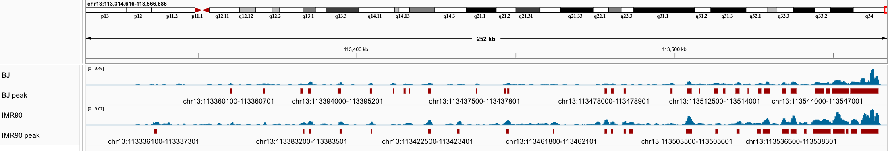

# Telomere-C ver 3.0

# Introduction

This pipeline processes Telomere-C sequencing data barcoded with unique molecular identifiers (UMIs) and produces output files, including Telomere-C peak coordinates and normalized read counts for downstream analysis. It also generates quality control (QC) metrics using GATK and FastQC, which are compatible with MultiQC to provide a comprehensive QC report.

The workflow is managed by Snakemake to ensure reproducible and scalable data analyses. It also prevents overwriting and allows resumption from interrupted jobs.

## Key Workflow Steps

**1. UMI Extraction**. Raw sequencing data is processed to extract UMI information within the reads. UMIs are critical for identifying and removing duplicate reads.

**2. Adapter Marking**. Illumina adapter sequences are marked to enable their removal during alignment, preserving the integrity of the sequence data.

**3. BWA Alignment**. Processed reads are aligned to a reference genome using BWA-MEM. The pipeline merges the aligned reads with metadata from the pre-alignment steps.

**4. UMI Grouping and Deduplication**. Reads are grouped by UMI and deduplicated to eliminate PCR artifacts, ensuring that only unique reads are retained for analysis.

**5. Reads Normalization**. Aligned reads are normalized using the Signal Extraction Scaling (SES) method, adjusted for GC-content, and normalization of read depth using functions provided by the [Regulatory Genomics Toolbox](https://reg-gen.readthedocs.io/en/latest/).

**6. Peak Calling**. For peak calling, a binomial distribution is applied to identify regions of significant enrichment. Candidate peaks are filtered based on p-value and dynamic coverage threshold.

# Graphic workflow of Telomere-C

---

# Installation
```
git clone git@github.com:barthel-lab/Telomere-C.git
cd Telomere-C
```

# Quick Start
```
snakemake --configfile config/config.yaml -d ~/PATH/OUTPUT --profile profile
```
Recommanded to excute a dry run to make sure everthings are in righ
```
snakemake --configfile config/config.yaml -d ~/PATH/OUTPUT -n
```

# Dependencies
- [Snakemake 8.14.0](https://snakemake.readthedocs.io/en/v8.14.0/)
- [RGT - Regulatory Genomics Toolbox](https://reg-gen.readthedocs.io/en/latest/rgt/installation.html)
- Python 3.11 (recommended for RGT)
- numpy 
- scipy
- [cutadapt 3.4](https://cutadapt.readthedocs.io/en/stable/)
- [gatk4 4.2.2.0](https://gatk.broadinstitute.org/hc/en-us/articles/360036194592-Getting-started-with-GATK4)
- [bwa 0.7.17](https://github.com/lh3/bwa)
- [samtools 1.13](http://www.htslib.org/)
- [telseq 0.0.2](https://github.com/zd1/telseq)
- [bedtools 2.30.0](https://bedtools.readthedocs.io/en/latest/)
- [deepTools 3.5.4](https://test-argparse-readoc.readthedocs.io/en/latest/index.html)
- [fastQC 0.12.0](https://www.bioinformatics.babraham.ac.uk/projects/fastqc/)
- [umi_tools 1.1.1](https://umi-tools.readthedocs.io/en/latest/QUICK_START.html)

# Configures

## Indexes
BWA indexes
```
bwa index <refernce.fasta>
```

- fasta indexes

- reference genome dictionary
```
gatk CreateSequenceDictionary -R "<refernce.fasta>" -O "<refernce.dict>"
```

If your refence fasta files are compressed (i.e. .gz or .bzip), use gatk tools to get normalized and uncompressed refence fasta file.
```
gatk NormalizeFasta -I <ref.fasta.gz> -O <ref.norm.fastq>
```

## Reference genome
Modify the path to reference fasta in the `workflow/rules/common.smk` line 7
```
ref_fasta="/PATH/TO/REFERENCE.fasta"
```
Note: the index files should be in the same directory of reference fasta
Check if you want to use block list in the `workflow/rules/common.smk` line 8
```
blacklist="data/T2T.excluderanges.noTelo.bed"
```

## Snakemake profile
For HPC user who are first time to snakeamake, create a file in `~/.config/snakemake/profile/config.yaml`.

Setup job management setting. Here use slurm as example
```
executor: slurm
latency-wait: 180
jobs: 1000
cores: 42
use-conda: true
restart-times: 1
rerun-incomplete: true

default-resources:
  #cpus_per_task: 42
  mem_mb: 50000
  slurm_account: tgen-332000
  #runtime: 24:00:00
```

## RGT 

For detailes, refer [Configuration of Genomic Data](https://reg-gen.readthedocs.io/en/latest/rgt/setup_data.html) to configure Genomic Data in the home directory. python = 3.11 is recommended.

Example for non-default reference genomes:

`~/rgtdata/data.config.user`
```
[CHM13v2]
genome: /tgen_labs/barthel/references/CHM13v2/chm13v2.0.fasta
chromosome_sizes: /tgen_labs/barthel/references/CHM13v2/chm13v2.0.size.genome
gene_regions: CHM13v2/CHM13v2.gene_regions.bed
annotation: CHM13v2/CHM13v2.annotation.gtf
gene_alias: hg38/alias_human.txt
```
- genome: The fasta file of the reference genome.
- chromosome_sizes: The size of the chromosome in the reference genome, can be acquired from the fasta index.
- gene_regions: Corrdinate of genes, can be acuqired by acquired by converting the gft file. e.g. `gtf2bed` from `GFFUtils`.
- annotation: Annotation of reference genome in gft format.
- gene_alias: Optional for our pipeline. You could assign it from existing gene_alias.

`~/rgtdata/CHM13v2/`
```
CHM13v2.annotation.gtf
CHM13v2.gene_regions.bed
```

## Peak calling

`scripts/primary_peak_call.py`

In lines 24-26, make sure the name of Genome data exists in `~/rgtdata/CHM13v2` 
```
24 # You must complete the Configuration of Genomic Data in your first time of running
25 # Please check: https://reg-gen.readthedocs.io/en/latest/rgt/setup_data.html
26 g = GenomeData('CHM13v2')
   ^^^^^^^
```

## config/config.yaml
Describe path of fastq file in yaml style.

Example:
```
data:
  BJP14:
    TelomereC:
      input:
        R1: /tgen_labs/barthel/fastq_DoNotTouch/20231030_LH00295_0016_A22F3LWLT3/BCL_0024/BCL_0024_1_UN_Whole_C1_UUUUU_K37343_22F3LWLT3_ACTAAGAT_L008_R1_001.fastq.gz
        R2: /tgen_labs/barthel/fastq_DoNotTouch/20231030_LH00295_0016_A22F3LWLT3/BCL_0024/BCL_0024_1_UN_Whole_C1_UUUUU_K37343_22F3LWLT3_ACTAAGAT_L008_R2_001.fastq.gz
      capture:
        R1: /tgen_labs/barthel/fastq_DoNotTouch/20231030_LH00295_0016_A22F3LWLT3/BCL_0024/BCL_0024_1_UN_Whole_C2_UUUUU_K37344_22F3LWLT3_GTCGGAGC_L008_R1_001.fastq.gz
        R2: /tgen_labs/barthel/fastq_DoNotTouch/20231030_LH00295_0016_A22F3LWLT3/BCL_0024/BCL_0024_1_UN_Whole_C2_UUUUU_K37344_22F3LWLT3_GTCGGAGC_L008_R2_001.fastq.gz

  IMR90:
    TelomereC:
      input:
        R1: /tgen_labs/barthel/fastq_DoNotTouch/230414_A00674_0567_BH5HVNDRX3/BCL_0010/BCL_0010_1_UN_Whole_C1_UUUUU_L65801_H5HVNDRX3_TACCGAGG_L001_R1_001.fastq.gz
        R2: /tgen_labs/barthel/fastq_DoNotTouch/230414_A00674_0567_BH5HVNDRX3/BCL_0010/BCL_0010_1_UN_Whole_C1_UUUUU_L65801_H5HVNDRX3_TACCGAGG_L001_R2_001.fastq.gz
      capture:
        R1: /tgen_labs/barthel/fastq_DoNotTouch/230414_A00674_0567_BH5HVNDRX3/BCL_0010/BCL_0010_1_UN_Whole_C2_UUUUU_L65802_H5HVNDRX3_CGTTAGAA_L001_R1_001.fastq.gz
        R2: /tgen_labs/barthel/fastq_DoNotTouch/230414_A00674_0567_BH5HVNDRX3/BCL_0010/BCL_0010_1_UN_Whole_C2_UUUUU_L65802_H5HVNDRX3_CGTTAGAA_L001_R2_001.fastq.gz
```

# Output files
All Output files were stored in the subdirectory of `results/`

## Main outputs
deduplicated BAM: 
- `results/UmiDeDup/<Sampe Name>-input.realn.mdup.MQ30.bam`
- `results/UmiDeDup/<Sampe Name>-capture.realn.mdup.MQ30.bam`

unnormalized BigWig:
- `results/bamCoverage/<Sampe Name>-input.realn.mdup.MQ30.norm.100bp.bigwig`
- `results/bamCoverage/<Sampe Name>-capture.realn.mdup.MQ30.norm.100bp.bigwig`

normalized BigWig files: 
- `results/RGT_peakCall/<Sampe Name>-capture.realn.mdup.MQ30.run_signal.bw`

called peaks: 
- `results/align/RGT_peakCall/<Sampe Name>-capture.realn.mdup.MQ30.run_peaks.merge.bed`

**IGV screenshot**

