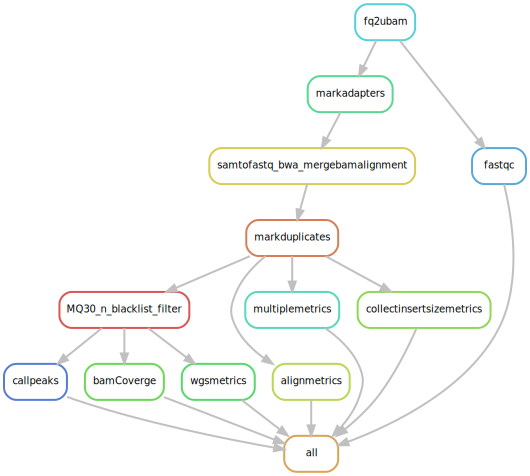

# Telomere-C
Telomere interaction analysis

---
This is a snakemake pipeline for Telomere-C data processing. Including adapter trimming, UMI barcoding processing, bwa alignment and peak calling. 

# Prerequisites

## Snakemake
[full install instructions for Snakemake](https://snakemake.readthedocs.io/en/stable/getting_started/installation.html). 

**Quick installation**
```
wget https://github.com/conda-forge/miniforge/releases/latest/download/Mambaforge-Linux-x86_64.sh
bash Mambaforge-Linux-x86_64.sh
```

**Build and activate environment**
```
mamba create -c conda-forge -c bioconda -n snakemake snakemake python=3.9
conda activate snakemake
```

## RGT - Regulatory Genomics Toolbox
[full install instruction of RGT](https://reg-gen.readthedocs.io/en/latest/rgt/installation.html).

**Quick installation**
```
pip install cython numpy scipy
pip install RGT
```
Please refer [Configuration of Genomic Data](https://reg-gen.readthedocs.io/en/latest/rgt/setup_data.html) to configure Genomic Data in the home directory. python > 3.9 is recommend.

## Other packages
Telomere-C required bellowing packages and suggested versions:

|packge_name|current version|document|
|:---   |:---            |:---|
|cutadapt|3.4|https://cutadapt.readthedocs.io/en/stable/|
|gatk4|4.2.2.0|https://gatk.broadinstitute.org/hc/en-us/articles/360036194592-Getting-started-with-GATK4|
|bwa|0.7.17|https://github.com/lh3/bwa|
|samtools|1.13|http://www.htslib.org/|
|telseq|0.0.2|https://github.com/zd1/telseq|
|bedtools|2.30.0|https://bedtools.readthedocs.io/en/latest/|
|macs2|2.2.7.1|https://hbctraining.github.io/Intro-to-ChIPseq/lessons/05_peak_calling_macs.html|
|deepTools|3.5.4|https://test-argparse-readoc.readthedocs.io/en/latest/index.html|
|fastqQC|0.12.0|https://www.bioinformatics.babraham.ac.uk/projects/fastqc/|
|umi_tools|1.1.1|https://umi-tools.readthedocs.io/en/latest/QUICK_START.html|

## Indexes
- BWA indexes
```
bwa index <refernce.fasta>
```

- fasta indexes

- reference genome dictionary
```
gatk CreateSequenceDictionary -R "<refernce.fasta>" -O "<refernce.dict>"
```

If your refence fasta files are compressed (i.e. .gz or .bzip), use gatk tools to get normalized and uncompressed refence fasta file.
```
gatk NormalizeFasta -I <ref.fasta.gz> -O <ref.norm.fastq>
```

# Configures

## Reference genome
Modify the path to reference fasta in the `Snakefile` line 3 
```
ref_fasta="/home/references/CHM13v2/chm13v2.0.fasta"
```
Note: the index files should be in the same directory of reference fasta

## Configure Slurm using Cookiecutter (Only for the first time of running)
We use [cookiecutter](https://github.com/cookiecutter/cookiecutter) to configure slurm for Telomere-C pipeline.

Installation
```
pipx install cookiecutter
```

Example setting for Slurm:
```
cookiecutter slurm
profile_name [slurm]: slurm_profile
sbatch_defaults []: --nodes=1 --cpus-per-task=8  --time=72:00:00 --mem=12G
cluster_config []:
Select advanced_argument_conversion:
1 - no
2 - yes
Choose from 1, 2 [1]: 2
cluster_name []: 
```

## Prepare the `fastqList.txt` File
Create a tab-separated file named fastqList.txt with the following format:
- Sample Name: Must include either `-input` or `-capture`.
- PATH1: Provide the full paths to the Fastq files for read1.
- PATH2: Provide the full paths to the Fastq files for read2.

Example:
```
Cell-input   /home/fastq/Cell-input.R1.fastq   /home/fastq/Cell-input.R2.fastq  
Cell-capture   /home/fastq/Cell-capture.R1.fastq   /home/fastq/Cell-capture.R2.fastq  
```

# Quick Start
Execute the following command to initiate a dry-run:
```
sh snakemake-run.sh  
```

Modify the Script for a full run by removing the `-n` option in snakemake-run.sh, line 12, then execute the command agagin
```
sh snakemake-run.sh  
```

# Output files
All Output files were stored in the subdirectory of `results/alig/`

## Main outputs
deduplicated BAM: 
- `results/align/UmiDeDup/<Sampe Name>-input.realn.mdup.MQ30.bam`
- `results/align/UmiDeDup/<Sampe Name>-capture.realn.mdup.MQ30.bam`

unnormalized BigWig:
- `results/align/bamCoverage/<Sampe Name>-input.realn.mdup.MQ30.norm.100bp.bigwig`
- `results/align/bamCoverage/<Sampe Name>-capture.realn.mdup.MQ30.norm.100bp.bigwig`

normalized BigWig files: 
- `results/align/RGT_peakCall/<Sampe Name>-capture.realn.mdup.MQ30.run_signal.bw`

called peaks: 
- `results/align/RGT_peakCall/<Sampe Name>-capture.realn.mdup.MQ30.run_peaks.merge.bed`
